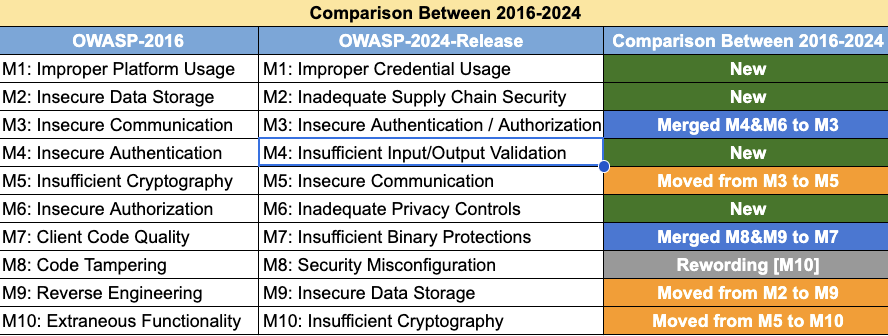

# Android Secure App

An Android application to learn and review security practices applying the latest OWASP Mobile Top 10
standards.
Additionally, you will find the resources used in this project, for example, libraries, techniques and tools.

## OWASP Mobile Top 10

  <picture>
    <source media="(prefers-color-scheme: dark)" srcset="images/owasp-logo.png">
    
  </picture>

> A project that born from OWASP Top 10 and OWASP MAS focused in release and standard based on the top 10 security risks.
> The main purpose is to identify and ranks the top ten most critical security risks to mobile applications.
> The top 10 serves as a standard framework to help developers, security professionals and organizations prioritize and address the most significant security issues in mobile app development.

  <picture>
    <source media="(prefers-color-scheme: dark)" srcset="images/comparison-owasp-10.png">
    
  </picture>

[OWASP Mobile Top 10]: <https://owasp.org/www-project-mobile-top-10/>

## References
[OWASP Mobile Application Security]: <https://owasp.org/www-project-mobile-app-security/>
[OWASP Mobile Top 10 Github]: <https://github.com/OWASP/www-project-mobile-top-10>
[Guardsquare AppSweep]: <https://www.guardsquare.com/appsweep-mobile-application-security-testing>
[RootBeer]: <https://github.com/scottyab/rootbeer>
[Android Security]: <https://source.android.com/docs/security>
[Andriod Security Allingments]: <https://developer.android.com/privacy-and-security/security-tips?hl=es-419>
[SQLCipher]: <https://github.com/sqlcipher/sqlcipher-android>
[EncryptedSharedPreferences]: <https://developer.android.com/reference/androidx/security/crypto/EncryptedSharedPreferences>